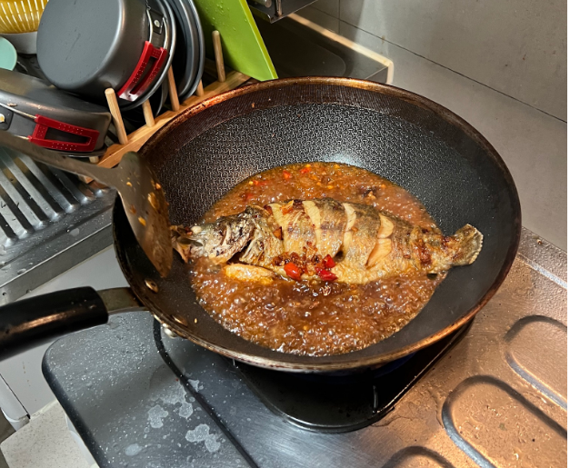
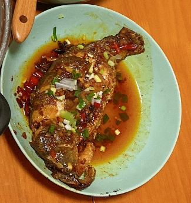

# XCHU_Recipe
my own recipes

## Braised Fish(红烧鱼)

### Prepare selected ingredients

- 河鱼一条，**武昌鱼、鲫鱼**最佳，鲈鱼亦可

- 4片姜片，切碎
- 5瓣蒜，切碎
- 一根大蒜
- 若干葱花
- 适量花椒，小米椒
- 2勺料酒
- 1勺醋
- 少许白糖
- 一勺豆瓣酱
- 几根香菜
- 半勺老抽
- 1勺生抽

### 腌制

1. 鱼去磷洗干净，两面切花刀或梅花刀
2. 食盐+料酒腌制15分钟

### 煎鱼

热锅冷油，油量较多，加**半勺食盐**，可防止鱼皮破了。

下鱼中火开始煎，至金黄，摇动锅，观察鱼底面是否煎好，用油覆盖全面。

翻面煎至金黄，出锅备用。

锅放油，下大蒜，蒜瓣，生姜，花椒，小米椒炒香，加一勺**豆瓣酱，炒出红油**，加一勺料酒去腥。

锅中下鱼，加生抽，老抽，一勺醋，大火烧开再煮10分钟，**加点白糖**再大火收汁。

起锅放入香菜和葱花，倒上汁液。

